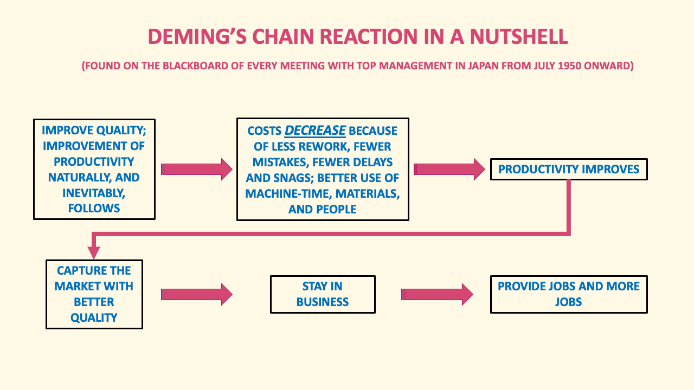

```{r, include = FALSE}
source("common.R")
```

Arrow-like characters in Unicode:

    Leftwards Arrow: ← &#x2190;
    Upwards Arrow: ↑ &#x2191;
    Rightwards Arrow: → &#x2192;
    Downwards Arrow: ↓ &#x2193;
    Diagonal Arrow: ↗ &#x2197;
    Diagonal Arrow: ↘ &#x2198;
    Bent Arrow: ↪ &#x21AA;
    Bent Arrow: ↩ &#x21A9;


::: {.rmdcaution}
RED BOX Example of an **.rmdcaution** block.

:::

::: {.rmdimportant}
GREEN BOX Example of an **.rmdimportant** block.

:::

::: {.rmdtip}
BLUE BOX Example of an **.rmdtip** block.

:::

::: {.rmdwarning}
BLUE VIOLET BOX Example of an **.rmdwarning** block.

:::


# The Role of Company Philosophy


<blockquote class="my-box" style="text-align: center;">
<p>
    <span style="font-size: 14px">MOTIVATION</span>
    <span style="font-size: 24px;">&plus;</span>
    <span style="font-size: 14px">ASPIRATION</span>
    <span style="font-size: 24px;">&plus;</span>
    <span style="font-size: 14px">CREATE VALUE</span>
    <span style="font-size: 24px;">&plus;</span>
    <span style="font-size: 14px;">COMPETITIVE STRATEGY </span>
    <span style="font-size: 24px;">&plus;</span>
    <span style="font-size: 14px;">MARKET TACTICS</span>
    <span style="font-size: 24px;">&plus;</span>
    <span style="font-size: 14px;">PHILOSOPHY</span>
    <span style="font-size: 24px;">&plus;</span>
    <span style="font-size: 14px;">OPERATIONS</span>
    <span style="font-size: 24px;">&plus;</span>
    <span style="font-size: 14px;">CUSTOMERS</span>
    <span style="font-size: 24px;">&plus;</span>
    <span style="font-size: 14px;">SOME LUCK</span>
    <span style="font-size: 24px;">=</span>
    <strong><span style="color: green; font-size: 20px">SUCCESS</span></strong>
  </p>
</blockquote>  


<blockquote class="my-quote">
  <p><strong>"If you work just for money, you'll never make it, but if you love what you're doing and you always put the customer first, success will be yours."</strong></p>
  <p class="quote-author">    attributed to Ray Kroc</p>
  <p class="quote-description">(founder of McDonald's restaurants)</p>
</blockquote>


## Your Fundamental Beliefs

Philosophy in this context refers to the fundamental beliefs, principles, and values that underpin the company's culture and decision-making processes. It reflects the owner's core values and approach to doing business and working with people.


<span style="color: maroon;">Example:  **"...people will be treated with respect at all times..."**</span> 


<span style="color: maroon;">Example:  **"...solutions are always sought on a WIN-WIN basis; everybody comes out better than they were before..."**</span> 
<br>
<br>
    
A company philosophy encompasses its ethical stance, its approach to customer service, its stance on social and environmental responsibility, and its attitude toward innovation, among other things.

<span style="color: maroon;">Example:  **"...while protecing the environment for future generations...and with the highest ethical standards..."**</span> 
<br>
<br>

Philosophy sets the tone for how the company operates on a day-to-day basis and influences its relationships with employees, customers, suppliers, and other stakeholders.

<span style="color: maroon;">Example:  **"...we are ladies and gentlemen serving ladies and gentlemen..."**</span> 


<span style="color: maroon;">Example:  **"...that employees have a right to take pride in their work.."**</span> 
<br>
<br>


## Business Philosophy - An Example

Your company philosophy should set forth the type of conduct expected from management, employees and the company as a whole while striving to achieve your company mission.  Some even extend it to suppliers and partners.

These rules of thumb are there to guide everyone's behavior and attitudes, from top to bottom. 

Here's a full-blown real-life example...(you might guess the company):

Aspiration (Mission):  "To make ever-better cars; to build a future where everyone has the freedom to move." 

Guiding Personal Principles:  

- "Always be faithful to your duties, thereby contributing to the Company and to the overall good."

- "Always be studious and creative, striving to stay ahead of the times."

- "Always be practical and avoid frivolousness."

- "Always strive to build a homelike atmosphere at work that is warm and friendly."

- "Always have respect for spiritual matters, and remember to be grateful at all times."


Guiding Company Principles:  

[The mission]..."is supported by two main pillars: 'Continuous Improvement' and 'Respect for People'.  We are never satisfied with where we are and always work to improve our business by putting forward new ideas and working to the best of our abilities.  We respect all [our] stakeholders, and believe the success of our business is created by individual effort and good teamwork." **

** For more details see https://www.toyota-global.com/company/history_of_toyota/75years/data/conditions/precepts/index.html

<br>

::: {.rmdcaution}
You Have a Company Philosophy Whether You Write it Down or Not

Many smaller businesses do not write this kind of stuff down.  Whether you publish it or not the marketplace will come to know it - for good or ill.  The fundamental attitudes and ethics of the owner(s) are experienced every day by those interacting with the company.  Even if no harm was meant, when customers are left to interpret every negative or ambiguous interaction in their own imagination - it usually doesn't end well.
:::
<br>


::: {.rmdtip}
ANNECDOTE

When moderating Customer Advisory Boards I ask the participants to describe what they believe are the company's Mission, Values, and Guiding Principles (including ethics).  The feedback from that one question alone is worth the cost of hosting the session.
:::
<br>
<br>


If your customers are ignorant or confused about your foundational beliefs you will never build a company that is exceptional in the marketplace.
<br>
<br>


::: {.rmdcaution}
<span style="color: red; font-weight: bold;">CAUTION</span>:  Don't publish foundational beliefs just for marketing and advertising purposes.  If you publish your foundational beliefs and don't live up to them (or don't timely correct an improper action) you will create a VERY unhappy customer who will tell many others about your 'hypocrisy'.

Customers are very sensitive to perceived hypocrisy and (rightfully) feel taken advantage of.  **For a company that relies on repeat business, paying lip service to its core beliefs is far worse than leaving them unstated, doing your best, then 'recovering' from customer complaints as best you can (the typical business strategy).**

I've always wondered why Ford felt 'Quality is Job #1' was a good tag line.  When the consumer spends that kind of money they fully expect that no one at Ford needs to be told that.  If it really was 'Job #1' the consumers would know it automatically by experience with the product.  Word does get around, you know!

:::


## Another Philosophy Example (optional material)

Should you choose to look into Dr. Deming's work with an aim to implement it, please contact me after you have read some of his writings, and before you try to implement it.  It is VERY easy to misunderstand some of the concepts and practices.  Otherwise, read on! [see also https://deming.org/]

This comprehensive example outlines the management philosophy of W. Edwards Deming, widely regarded as the 'father' of the Japanese economic miracle after WWII.  If studied with diligence and vigor it is unbelievable in the depth and breadth of its power for you to create a difference in the marketplace.

### A System of Profound Knowledge (taken ins substantive part from https://en.wikipedia.org/wiki/W._Edwards_Deming)

Since Dr. Deming's work is a comprehensive system of beliefs, values, principles, and ideas that guide and inform management's approach to industry, service, education, and government his system can righfully be regarded as a philosophy.

It includes four components or "lenses" (we might call them rules of thumb) through which to view the world simultaneously:

1. Appreciation for a system:  This is a rule-of-thumb that includes the ideas of:

  Coordination and cooperation of the overall system involving suppliers, producers, and customers (or recipients) of goods and services is the responsibility of management;
  
  Win-Win solutions, cooperations, not competition between parts
    
1. Knowledge about variation:

    Understanding of the range and causes of variation in quality, people, machines, methods, measurements and use of statistical procedures in interpreting measurements;

1. Theory of knowledge:

    Concepts explaining knowledge and the limits of what can be known.

1. Knowledge of psychology:

    Understanding human nature.
<br>

### The 14 Points

1. Create constancy of purpose toward improvement of product and service, with the aim to become competitive, to stay in business and to provide jobs.

1. Adopt the new philosophy. We are in a new economic age. Western management must awaken to the challenge, must learn their responsibilities, and take on leadership for change.

1. Cease dependence on inspection to achieve quality. Eliminate the need for massive inspection by building quality into the product in the first place.

1. End the practice of awarding business on the basis of a price tag. Instead, minimize total cost. Move towards a single supplier for any one item, on a long-term relationship of loyalty and trust.

1. Improve constantly and forever the system of production and service, to improve quality and productivity, and thus constantly decrease costs.

1. Institute training on the job.

1. Institute leadership (see Point 12 and Ch. 8 of Out of the Crisis). The aim of supervision should be to help people and machines and gadgets do a better job. Supervision of management is in need of overhaul, as well as supervision of production workers.

1. Drive out fear, so that everyone may work effectively for the company. (See Ch. 3 of Out of the Crisis)

1. Break down barriers between departments. People in research, design, sales, and production must work as a team, to foresee problems of production and usage that may be encountered with the product or service.

1. Eliminate slogans, exhortations, and targets for the work force asking for zero defects and new levels of productivity. Such exhortations only create adversarial relationships, as the bulk of the causes of low quality and low productivity belong to the system and thus lie beyond the power of the work force.

1. Eliminate work standards (quotas) on the factory floor. Substitute with leadership.

1. Eliminate management by objective. Eliminate management by numbers and numerical goals. Instead substitute with leadership.

1. Remove barriers that rob the hourly worker of his right to pride of workmanship. The responsibility of supervisors must be changed from sheer numbers to quality.

1. Remove barriers that rob people in management and in engineering of their right to pride of workmanship. This means, inter alia, abolishment of the annual or merit rating and of management by objectives (See Ch. 3 of Out of the Crisis).

1. Institute a vigorous program of education and self-improvement.

1. Put everybody in the company to work to accomplish the transformation. The transformation is everybody's job.


### The "Seven Deadly Diseases"

1. Lack of constancy of purpose

1. Emphasis on short-term profits

1. Evaluation by performance, merit rating, or annual review of performance

1. Mobility of management

1. Running a company on visible figures alone

1. Excessive medical costs

1. Excessive costs of warranty, fueled by lawyers who work for contingency fees


### A Lesser Category of Obstacles

1. Neglecting long-range planning

1. Relying on technology to solve problems

1. Seeking examples to follow rather than developing solutions

1. Excuses, such as "our problems are different"

1. The mistaken belief that management skills can be taught in classes[38]

1. Reliance on quality control departments rather than management, supervisors, managers of purchasing, and production workers

1. Placing blame on workforces who are responsible for only 15% of mistakes while the system designed by management is responsible for 85% of the unintended consequences

1. Relying on quality inspection rather than improving product quality


## Ideas into Actions

::: {.rmdimportant}

Outline Your Business Philosophy

**EXERCISE 2-1**

***"Ideas take form when you commit them to writing."***

1. **Draft your business philosophy.**
<br><br>

1. **Draft a set of Guiding Principles for your people to follow with respect to customers, suppliers and each other.  Be succinct.**
<br><br>

1. **Draft your Guiding Company Principles to establish how the company is to behave in the marketplace (what do you consider 'good' and 'bad' company behavior?).**
<br><br>

It may take years to hammer out a comprehensive philosophy, but create a starting point NOW.
:::
<br>


## Catchy Phrases and Maxims

For an organization who chooses service as their key to being unique in the marketplace...

<div align="center">

**DELIGHTED EMPLOYEES <span style="font-size: 24px;">&#x2192;</span> DELIGHTED CUSTOMERS <span style="font-size: 24px;">&#x2192;</span> DELIGHTED BANKER <span style="font-size: 24px;">&#x2192;</span> DELIGHTED OWNER**

</div>

For a service organization with less ambition in the marketplace...

<div align="center">

**SATISFIED EMPLOYEES <span style="font-size: 24px;">&#x2192;</span> SATISFIED CUSTOMERS <span style="font-size: 24px;">&#x2192;</span> SATISFIED BANKER <span style="font-size: 24px;">&#x2192;</span> SATISFIED OWNER**

</div>

For a company who chooses to be unique by technical leadership...

<div align="center">

**UNIQUE TECHNICAL INNOVATION <span style="font-size: 24px;">&#x2192;</span> DELIGHTED CUSTOMERS <span style="font-size: 24px;">&#x2192;</span> DELIGHTED BANKER <span style="font-size: 24px;">&#x2192;</span> DELIGHTED OWNER**

</div>


We MUST Have Repeat Business to Survive &#x2192; Our Mission is to Create Delighted Customers

Being Different Is Critical For Our Success &#x2192; We Are Committed to Being a Leader in our Marketplace


Being Different Is Critical For Our Success &#x2192; We Must Have Repeat Business &#x2192; To Return Customers Must Be Delighted and Feel Valued &#x2192; Adopt This Motto: "The Customer is Always Right; If the Customer is Ever Wrong, See Previous Rule" &#x2192; Honor That Commitment Every Day in Every Way &#x2192; This Amazing Commitment to Customers Will Set Us Apart from Competitors &#x2192; We Stay in Business &#x2192; Create Jobs, and More Jobs

Here is the Chain Reaction Diagram Dr. W. Edwards Deming had on the chalkboard at every meeting with Japanese business leaders, beginning in 1950.




Here's one chain reaction (theory) that underpins WHY Stew Leonard's operates the way it does:

<div align="center">

**HAPPY EMPLOYEES <span style="font-size: 24px;">&#x2192;</span> HAPPY CUSTOMERS <span style="font-size: 24px;">&#x2192;</span> HAPPY BANKER <span style="font-size: 24px;">&#x2192;</span> HAPPY OWNER**

</div>


###########################
Personally, I think these challenges create a great opportunity for experienced programmers to have a profound positive impact on R and the R community. R users do care about writing high quality code, particularly for reproducible research, but they don't yet have the skills to do so. I hope this book will not only help more R users to become R programmers, but also encourage programmers from other languages to contribute to R.

## Who should read this book {#who-should-read}

This book is aimed at two complementary audiences:

* Intermediate R programmers who want to dive deeper into R, understand how
  the language works, and learn new strategies for solving diverse problems.

* Programmers from other languages who are learning R and want to understand
  why R works the way it does.

To get the most out of this book, you'll need to have written a decent amount of code in R or another programming language. You should be familiar with the basics of data analysis (i.e. data import, manipulation, and visualisation), have written a number of functions, and be familiar with the installation and use of CRAN packages.

This book walks the narrow line between being a reference book (primarily used for lookup), and being linearly readable. This involves some tradeoffs, because it's difficult to linearise material while still keeping related materials together, and some concepts are much easier to explain if you're already familiar with specific technical vocabulary. I've tried to use footnotes and cross-references to make sure you can still make sense even if you just dip your toes in a chapter.  

## What you will get out of this book {#what-you-will-get}

This book delivers the knowledge that I think an advanced R programmer should possess: a deep understanding of the fundamentals coupled with a broad vocabulary that means that you can tactically learn more about a topic when needed.

After reading this book, you will:

* Be familiar with the foundations of R. You will understand complex data types
  and the best ways to perform operations on them. You will have a deep
  understanding of how functions work, you'll know what environments are, and 
  how to make use of the condition system.

* Understand what functional programming means, and why it is a useful tool for
  data science. You'll be able to quickly learn how to use existing tools, and
  have the knowledge to create your own functional tools when needed.

* Know about R's rich variety of object-oriented systems. You'll be most 
  familiar with S3, but you'll know of S4 and R6 and where to look for more
  information when needed.

* Appreciate the double-edged sword of metaprogramming. You'll be able to
  create functions that use tidy evaluation, saving typing and creating elegant 
  code to express important operations. You'll also understand the dangers 
  and when to avoid it.

* Have a good intuition for which operations in R are slow or use a lot of
  memory. You'll know how to use profiling to pinpoint performance
  bottlenecks, and you'll know enough C++ to convert slow R functions to
  fast C++ equivalents.

## What you will not learn

This book is about R the programming language, not R the data analysis tool. If you are looking to improve your data science skills, I instead recommend that you learn about the [tidyverse](https://www.tidyverse.org/), a collection of consistent packages developed by me and my colleagues. In this book you'll learn the techniques used to develop the tidyverse packages; if you want to instead learn how to use them, I recommend [_R for Data Science_](http://r4ds.had.co.nz/).

If you want to share your R code with others, you will need to make an R package. This allows you to bundle code along with documentation and unit tests, and easily distribute it via CRAN. In my opinion, the easiest way to develop packages is with [devtools](http://devtools.r-lib.org), [roxygen2](http://roxygen2.r-lib.org/), [testthat](http://testthat.r-lib.org), and [usethis](http://usethis.r-lib.org). You can learn about using these packages to make your own package in [_R packages_](http://r-pkgs.had.co.nz/).

## Meta-techniques {#meta-techniques}

There are two meta-techniques that are tremendously helpful for improving your skills as an R programmer: reading source code and adopting a scientific mindset.

Reading source code is important because it will help you write better code. A great place to start developing this skill is to look at the source code of the functions and packages you use most often. You'll find things that are worth emulating in your own code and you'll develop a sense of taste for what makes good R code. You will also see things that you don't like, either because its virtues are not obvious or it offends your sensibilities. Such code is nonetheless valuable, because it helps make concrete your opinions on good and bad code.

A scientific mindset is extremely helpful when learning R. If you don't understand how something works, you should develop a hypothesis, design some experiments, run them, and record the results. This exercise is extremely useful since if you can't figure something out and need to get help, you can easily show others what you tried. Also, when you learn the right answer, you'll be mentally prepared to update your world view.

## Recommended reading {#recommended-reading}

Because the R community mostly consists of data scientists, not computer scientists, there are relatively few books that go deep in the technical underpinnings of R. In my personal journey to understand R, I've found it particularly helpful to use resources from other programming languages. R has aspects of both functional and object-oriented (OO) programming languages. Learning how these concepts are expressed in R will help you leverage your existing knowledge of other programming languages, and will help you identify areas where you can improve.

To understand why R's object systems work the way they do, I found _The Structure and Interpretation of Computer Programs_[^SICP] [@SICP] (SICP) to be particularly helpful. It's a concise but deep book, and after reading it, I felt for the first time that I could actually design my own object-oriented system. The book was my first introduction to the encapsulated paradigm of object-oriented programming found in R, and it helped me understand the strengths and weaknesses of this system. SICP also teaches the functional mindset where you create functions that are simple individually, and which become powerful when composed together.

[^SICP]: You can read it online for free at <https://mitpress.mit.edu/sites/default/files/sicp/full-text/book/book.html>

To understand the trade-offs that R has made compared to other programming languages, I found _Concepts, Techniques and Models of Computer Programming_ [@ctmcp] extremely helpful. It helped me understand that R's copy-on-modify semantics make it substantially easier to reason about code, and that while its current implementation is not particularly efficient, it is a solvable problem.

If you want to learn to be a better programmer, there's no place better to turn than _The Pragmatic Programmer_ [@pragprog]. This book is language agnostic, and provides great advice for how to be a better programmer.

## Getting help {#getting-help}
\index{help}
\index{reprex}

Currently, there are three main venues to get help when you're stuck and can't figure out what's causing the problem: [RStudio Community](https://community.rstudio.com/), [StackOverflow](http://stackoverflow.com) and the [R-help mailing list][r-help]. You can get fantastic help in each venue, but they do have their own cultures and expectations. It's usually a good idea to spend a little time lurking, learning about community expectations, before you put up your first post. 

Some good general advice:

* Make sure you have the latest version of R and of the package (or packages)
  you are having problems with. It may be that your problem is the result of
  a recently fixed bug.

* Spend some time creating a **repr**oducible **ex**ample, or reprex.
  This will help others help you, and often leads to a solution without
  asking others, because in the course of making the problem reproducible you 
  often figure out the root cause. I highly recommend learning and using
  the [reprex](https://reprex.tidyverse.org/) package.

<!-- GVW: is someone going to go through once you're done and create a glossary? If you've flagged things like "reprex" in bold, it ought to be easy to find terms. -->

If you are looking for specific help solving the exercises in this book, solutions from Malte Grosser and Henning Bumann are available at <https://advanced-r-solutions.rbind.io>.

## Acknowledgments {#intro-ack}

I would like to thank the many contributors to R-devel and R-help and, more recently, Stack Overflow and RStudio Community. There are too many to name individually, but I'd particularly like to thank Luke Tierney, John Chambers, JJ Allaire, and Brian Ripley for generously giving their time and correcting my countless misunderstandings.

This book was [written in the open](https://github.com/hadley/adv-r/), and chapters were advertised on [twitter](https://twitter.com/hadleywickham) when complete. It is truly a community effort: many people read drafts, fixed typos, suggested improvements, and contributed content. Without those contributors, the book wouldn't be nearly as good as it is, and I'm deeply grateful for their help. Special thanks go to Jeff Hammerbacher,  Peter Li, Duncan Murdoch, and Greg Wilson, who all read the book from cover-to-cover and provided many fixes and suggestions.

```{r, eval = FALSE, echo = FALSE}
library(tidyverse)
contribs_all_json <- gh::gh("/repos/:owner/:repo/contributors",
  owner = "hadley",
  repo = "adv-r",
  .limit = Inf
)
contribs_all <- tibble(
  login = contribs_all_json %>% map_chr("login"),
  n = contribs_all_json %>% map_int("contributions")
)

contribs_old <- read_csv("contributors.csv", col_types = list())
contribs_new <- contribs_all %>% anti_join(contribs_old, by = "login")

# Get info for new contributors
needed_json <- map(
  contribs_new$login, 
  ~ gh::gh("/users/:username", username = .x)
)
info_new <- tibble(
  login = contribs_new$login,
  name = map_chr(needed_json, "name", .default = NA),
  blog = map_chr(needed_json, "blog", .default = NA)
)
info_old <- contribs_old %>% select(login, name, blog)
info_all <- bind_rows(info_old, info_new)

contribs_all <- contribs_all %>% 
  left_join(info_all, by = "login") %>% 
  arrange(login)
write_csv(contribs_all, "contributors.csv")
```

```{r, results = "asis", echo = FALSE, message = FALSE}
library(dplyr)
contributors <- read.csv("contributors.csv", stringsAsFactors = FALSE)
contributors <- contributors %>% 
  filter(login != "hadley") %>% 
  mutate(
    login = paste0("\\@", login),
    desc = ifelse(is.na(name), login, paste0(name, " (", login, ")"))
  )

cat("A big thank you to all ", nrow(contributors), " contributors (in alphabetical order by username): ", sep = "")
cat(paste0(contributors$desc, collapse = ", "))
cat(".\n")
```

## Conventions {#conventions}

Throughout this book I use `f()` to refer to functions, `g` to refer to variables and function parameters, and `h/` to paths. 

Larger code blocks intermingle input and output. Output is commented (`#>`) so that if you have an electronic version of the book, e.g., <https://adv-r.hadley.nz/>, you can easily copy and paste examples into R.

Many examples use random numbers. These are made reproducible by `set.seed(1014)`, which is executed automatically at the start of each chapter.

\newpage
## Colophon {#colophon}

This book was written in [bookdown](http://bookdown.org/) inside [RStudio](http://www.rstudio.com/ide/). The [website](https://adv-r.hadley.nz/) is hosted with [netlify](http://netlify.com/), and automatically updated after every commit by [travis-ci](https://travis-ci.org/). The complete source is available from [GitHub](https://github.com/hadley/adv-r). Code in the printed book is set in [inconsolata](http://levien.com/type/myfonts/inconsolata.html). Emoji images in the printed book come from the open-licensed [Twitter Emoji](https://github.com/twitter/twemoji).

This version of the book was built with `r R.version.string` and the following packages.

```{r, echo = FALSE, results="asis"}
# deps <- desc::desc_get_deps()$package[-1]
# 
# pkgs <- sessioninfo::package_info(deps, dependencies = FALSE)
# df <- tibble(
#   package = pkgs$package,
#   version = pkgs$ondiskversion,
#   source = gsub("@", "\\\\@", pkgs$source)
# )
# knitr::kable(df, format = "markdown")
```

```{r, include = FALSE}
# ruler <- function(width = getOption("width")) {
#   x <- seq_len(width)
#   y <- case_when(
#     x %% 10 == 0 ~ as.character((x %/% 10) %% 10),
#     x %% 5 == 0  ~ "+",
#     TRUE         ~ "-"
#   )
#   cat(y, "\n", sep = "")
#   cat(x %% 10, "\n", sep = "")
# }
# 
# ruler()
```

[r-help]: https://stat.ethz.ch/mailman/listinfo/r-help
[rstats-twitter]: https://twitter.com/search?q=%23rstats
[r-meetups]: https://www.meetup.com/topics/r-programming-language/
[rweekly]: https://rweekly.org
[r-ladies]: http://r-ladies.org
[rmarkdown]: https://rmarkdown.rstudio.com
[shiny]: http://shiny.rstudio.com
