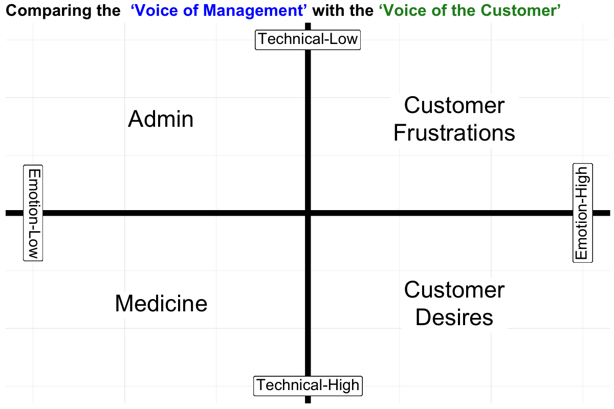
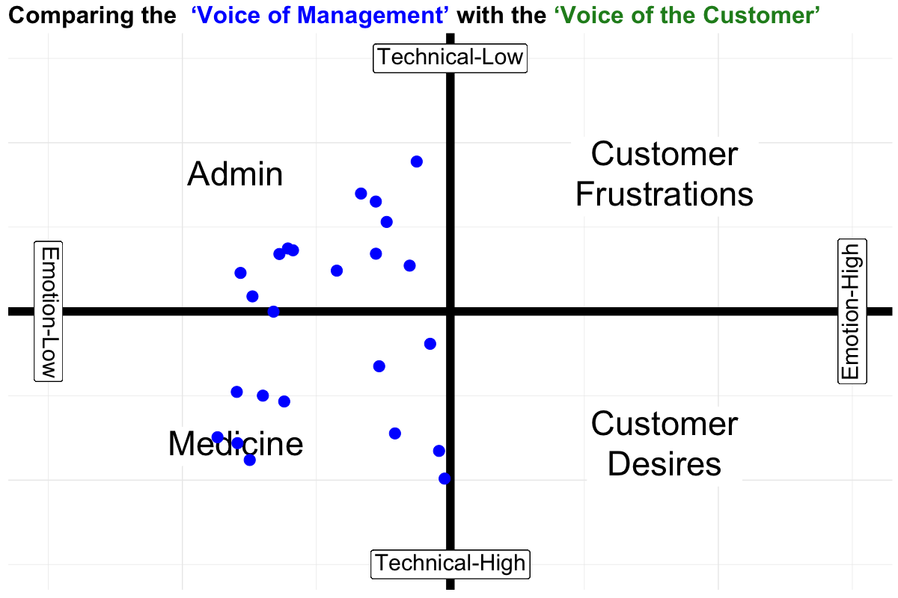
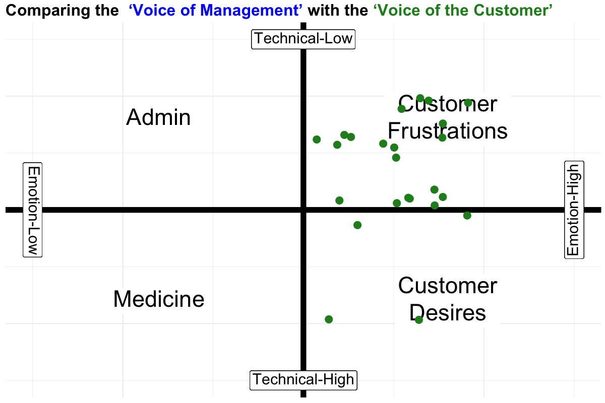
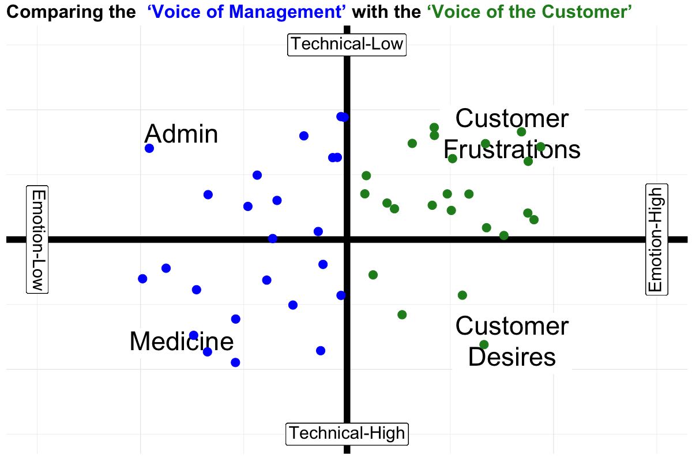

::: {.rmdcaution}
RED BOX Example of an **.rmdcaution** block.
:::

::: {.rmdimportant}
GREEN BOX Example of an **.rmdimportant** block.
:::

::: {.rmdtip}
BLUE BOX Example of an **.rmdtip** block.
:::

::: {.rmdwarning}
BLUEVIOLET BOX Example of an **.rmdwarning** block.
:::

# It Pays to… Be UNIQUE! 

The aim of this chapter is to help you succeed; so you can make a difference in this world.  It outlines practical ways to make your company more Effective, Capable, and Unique so you can turn all your hard work into prosperity for yourself and others, and live a better life.

Say your Mission is to 'Create Happy Customers'.

THE CHALLENGE YOU FACE...is how to become Unique in the marketplace because the more Unique you are, the more successfull you can become.

In the Marketplace Contrast is Power

{width=200px height=100px}

The best way to contrast with your competitors is to be very Effective AND very Capable -- from your customer's point of view

Unique means Standing out from the crowd.  
 

{width=200px height=100px}
 

{width=200px height=100px}
 
 

Unique means being unconventional.
 
 
 

{width=200px height=100px}
 
 

Avoid conventional logic because all your competitors will use that.
 

{width=200px height=100px}

Test counter-intuitive ideas because your competitors won't.

What is the Best Way to 'Stand Out' and Be Unique? 

Create the unstoppable chain reaction: Become very Effective, then Build awesome Capability to deliver, And you will be irresistably Unique

So, what does it mean to be "effective?"  Effective means knowing what creates REAL value for customers - in their terms and having the capability to deliver it upon demand

Effective means... Strictly from the customer's point of view.  Your efforts must be Useful, or Fulfill a desire, or Solve a problem -- From the customer's point of view

Effective does NOT mean Expedient.  Expedient = Quick, Interim or Temporary, Short-term -- often at the expense of the long-term.  Putting out fires, often at the expense of the customer

Strangely, the opposite is NOT true: Efficient ≠ Effective.  As you become more Effective you will automatically become more efficient. 
Productive ≠ Effective 

As you become more Effective you will automatically become more productive.  But, don't just take my word for it... Let's hear what Warren Buffet thinks about Effectiveness in delighting customers

<iframe width="650" height="450" src="https://www.youtube.com/embed/YUn7xTL4k6o?si=oIjmeeDb0HIKWYX3&rel=0" title="YouTube video player" frameborder="0" allow="accelerometer; autoplay; clipboard-write; encrypted-media; gyroscope; picture-in-picture; web-share" allowfullscreen></iframe>

Buffet on the Importance of 'Customer Delight

Some Cold, Hard Facts... 

- Half of new businesses fail in 5 years.
- By year 10 fully two-thirds are gone. 
- Only 10% make it to 20 years.

Studies and surveys also show shocking failure rates for improvement initiatives that can range from 50% to 70% or even higher.

If you are ambitious and flexible, this is all good news for you!

* If you become Effective enough, 
* If you become Capable enough, 
* You will become Unique enough. 

It’s not remarkable that companies fail. It’s remarkable that they fail so often, and have for so long! 

Obviously, we make the same mistakes over and over again.  Otherwise, those grim survival statistics would have improved long ago.  

And what about the companies that are just surviving? They are neither fully alive nor completely dead.  This is not a laziness problem, or an intelligence problem.  Most business owners are very hard- working, and good at what they do.  But they’re not very good at turning all that hard work into prosperity and a better life. 

Where Companies Go Wrong

- They are ‘Same-As’: EACH COMPANY JUST LIKE THE REST.  Afraid to be different.

'Same-As' companies don't last long in the marketplace. They Copy, Copy, Copy 

Everyone from business schools to self-help books continue to tell owners that copying others is the solution to their problems.  'Follow-the-Herd' companies don't stand a chance in the marketplace.   Woo Hoo! Let's do what everyone else does! 

On top of that, most 'Solutions' are Incompatible with your existing systems.  For example, companies naturally adopt the style of management known as ‘command-and-control’.  Unfortunately, most improvement schemes (and many company goals) are incompatible with this style of management.  So, most improvement efforts are doomed from the outset.

So, what's a leader to do? 
* Learn to be more Effective, in the eyes of your customers 
* Learn to be more Capable in the eyes of your customers 
* Learn to be more Unique in the eyes of your customers 

These things hardly cost a thing...but, they require a different mindset, a sense of urgency, and the willingness to try new things. 
The reward is to become Unique in the marketplace -- which is the Point! 

WHAT TO DO NOW? 

FIRST... Adopt a plain-spoken aim such as "Our Mission is to Create Happy Customers!" Lose the corporate-speak, gobbelty-gook jargon.  It makes it much harder for everyone to do a great job.

Next... learn first-hand what your customers value -- from their point of view.

Next...learn first-hand, what your customers experience when dealing with your company (the good, bad, and ugly).

Management Is Not Very Good at Guessing What Customers Value.  So, it PAYS (a lot) to Ask Them Directly.

Case Study:  Initially, Dr. T and her team came up with 23 ideas of how to create more value for her customers.  Let's see how they did by themselves...
 

A vizualization of the two dimensions of customer value, the technical dimension and the emotional dimension.  In the veterinary services sector

Medicine is high on the Technical and low on Emotional dimentions.
Administration activities are low on both the Emotional and the Technical dimensions.  
Customer Desires are high on the Technical dimension and the Emotional dimensions.
Customer Frustrations are high on the Emotional dimension and low on the Technical dimension.

This is represented with this graph:

 
 

 
 

 
 

If there is any way at all Ask Customers Directly!  It PAYS (a lot) to Ask Them Directly

Then...create Capability so customers can pull the value they need from you when, where, and how they want to.   

Case Study:  Stew Leonard's Dairy has mastered the ability to 'Listen, then Deliver' 

<iframe width="650" height="450" src="https://www.youtube.com/embed/lQ32eHkIIZ4?si=99AJl27fm1S2aRSj&rel=0" title="YouTube video player" frameborder="0" allow="accelerometer; autoplay; clipboard-write; encrypted-media; gyroscope; picture-in-picture; web-share" allowfullscreen></iframe>

Stew Jr on the Power of Customer Suggestions 

Some Things To AVOID...

BEWARE OF... 

- Slogans,
- so-called ‘best practices’, 
- Agile,
- Lean or Six-Sigma, 
- Mission & Vision statements full of buzzwords, 
- Servant leadership,  

These are all management fads and they all have one thing in common:  they avoid the responsibiltiy of management to create and maintain a system based on Effectiveness and Capability

GUIDING PRINCIPLES for Action

Apply your GUIDING PRINCIPLES daily to get AMAZING RESULTS

GUIDING PRINCIPLE: Focus on measures of Effectiveness ~ Not on measures of Efficiency

When you focus on measures of Effectiveness & Capability ~ You will automatically be more Efficient and Productive.

To be Unique You Must Be Effective! (EVERY DAY) 

To be Unique You Must Be Capable! (EVERY DAY)

If you're looking for a 'sure-fire', low-cost way to prosper in the marketplace... Become very Unique, and one sure-fire way is to become very Effective and very Capable.

