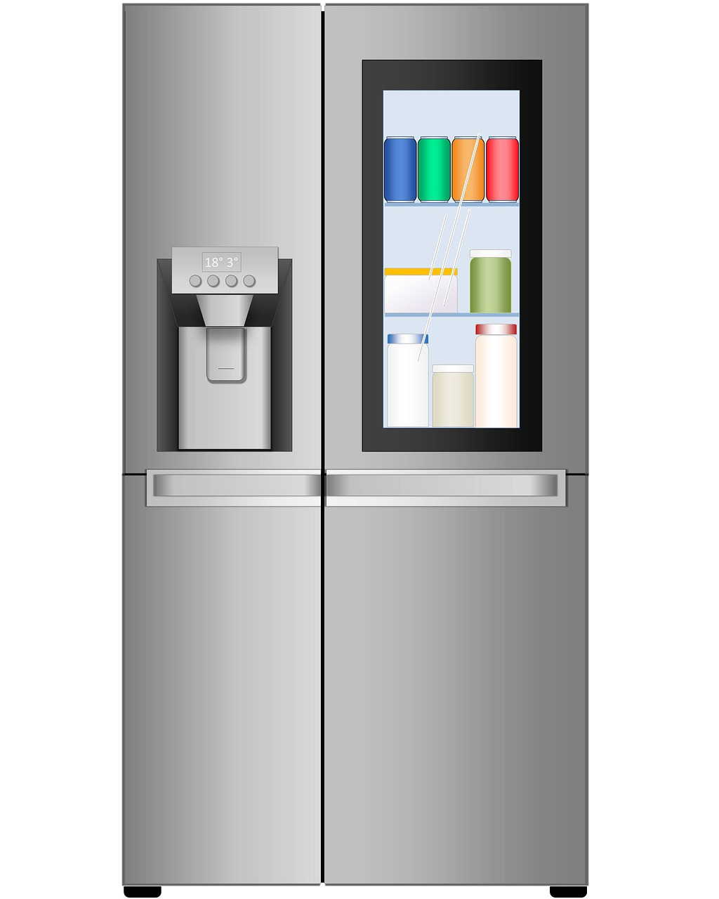
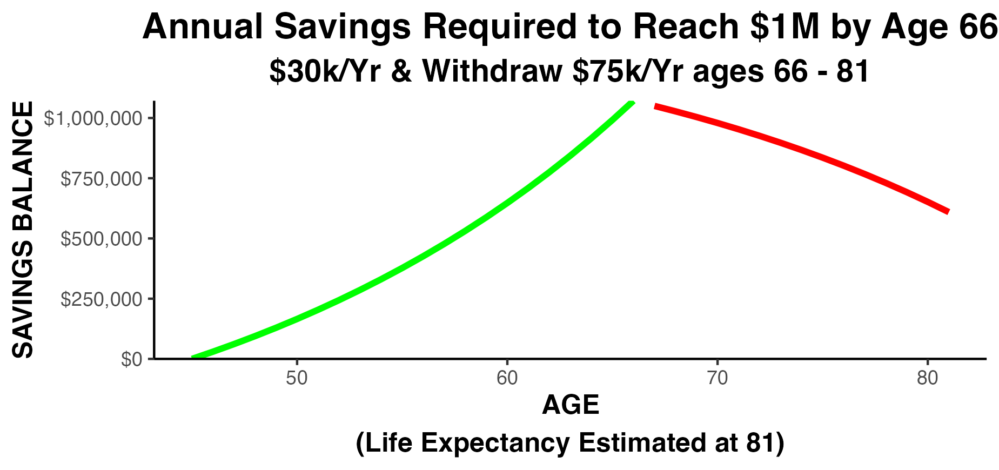
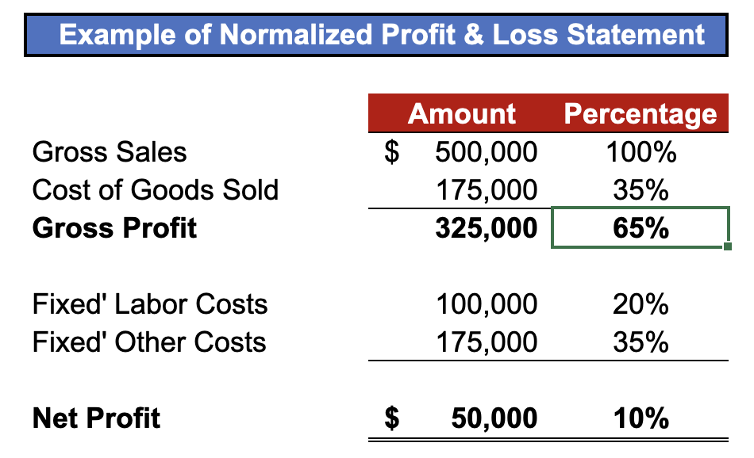

<!--  -->

# Calculate Your Desired Minimum Sales Level

PRINCIPLE: Know Your Desired Minimum Sales Level Before You Begin Marketing.  Your Desired Minimum Sales will determine the type of customer you need to attract to your business.

What is your DESIRED MINIMUM SALES level?

HOW do you figure that out?! &nbsp;&nbsp;&nbsp;WHY is it so important?    

 
If Your SALES are TOO SMALL Your TOTAL PROFIT will be TOO SMALL.  
If your total profit is too small:  
    
You can work your life away and never gain financial security,  
      
    
It can drain your life savings,  
      

The strain on your personal life can lead to serious health and life problems,  
    

    
  
Your disappointments will be many, and  
    
    
You will work forever, with no possibility of retirement   
  
  

Those are some of the important WHYs to set a Desired Minimum Sales level.
 

## HOW to figure out your Desired Minimum Sales Level?

Estimate just 6 things and you can compute your Desired Minimum Sales:

1. Desired Salary (sufficient to cover your cash needs, and your wants)
1. Desired annual retirement contribution 
1. Annual healthcare premiums
1. FIXED costs for 'Labor' (as a percentage of gross sales), and 
1. FIXED costs for all 'Other Expenses' (as a percentage of gross sales) 
1. Net Profit, after expenses (to be used for next year's working capital) 

## Estimating A Desired Salary Level

Now, the first thing on that list is a 'Desired Salary'.  Right now you are probably just paying yourself 'what the company can afford.'  But, the estimation of your 'Desired Minimum Sales' must be based on what you want your salary to become, not what it is right now.

Your Desired Salary must be large enough to cover your cash requirements for: 

* food, 
 

* utilities, 

* shelter (in a safe neighborhood), 

* some financial security, 

* healthcare safety, 

* education for loved ones, and 

* charitable giving (if you're so inclined) 

  
Add these items up.and that's your NET desired salary.  A simple conversion factor will transform the net salary figure into a GROSS Salary figure.

Here's an example of the entire calculation using fictitious amounts: 

## Estimating Your Desired Minimum Sales Level

In outline form the calculation grid looks like this: 

<table style="width: 45vw; height: auto; font-size: 18px">
  <tr>
    <td class="b darkgreen bb bw2 al">Estimate Needed</td>
    <td class="b darkgreen bb bw2 ar">Amount</td>
  </tr>
  <tr>
    <td class="b bg-white black al">Desired Salary</td>
    <td class="b black ar">$ ???</td>
  </tr>
  <tr>
    <td class="b black">Annual Retirement Contribution</td>
    <td class="b black" style="text-align: right;">$ ???</td>
  </tr>
  <tr>
    <td class="b black">Annual Health Insurance</td>
    <td class="b black" style="text-align: right;">$ ???</td>
  </tr>
  <tr>
    <td class="b black">Fixed Labor Cost</td>
    <td class="b black" style="text-align: right;">?? %</td>
  </tr>
  <tr>
    <td class="b black">Fixed Other Costs</td>
    <td class="b black" style="text-align: right;">?? %</td>
  </tr>
  <tr>
    <td class="b black">Residual Profit</td>
    <td class="b black" style="text-align: right;">$ ???</td>
  </tr>
</table>

Assume you worked out the calculation and you want your GROSS salary to be $150,000 annually 

<table style="width: 50vw; height: auto; font-size: 18px">
  <tr>
    <td class="b darkgreen bb bw2 al">Estimate Needed</td>
    <td class="b darkgreen bb bw2 ar">Amount</td>
  </tr>
  <tr>
    <td class="b black bg-yellow al">Desired Salary</td>
    <td class="b black bg-yellow ar">$150,000</td>
  </tr>
</table>

Next, the business must cover your annual retirement plan contribution.  This depends entirely on WHEN you begin your retirement savings.  Let's look at several scenarios... 

Let's assume your goal is to save $1,000,000 by the time you are 66 years old
Starting at
age 30:
$11,000
annually to
reach $1M by
age 66:  

Starting at
age 35:
$15,000
annually to
reach $1M by
age 66:  

Starting at
age 40:
$20,000
annually to
reach $1M by
age 66:  

Starting at
age 45:
$30,000
annually to
reach $1M by
age 66:  

Starting at
age 50:
$45,000
annually to
reach $1M by
age 66:  

  
The required contribution increases DRAMATICALLY if you start later. Watch as the amount you need swoops upward

<iframe src="html/curve.of.increasing.reqd.contribs.animation.with.strikelines.html" width="800" height="400"></iframe>

The lesson of this graph is:

The graph is NOT a straight line; it swoops upward more and more as you approach age 50. Soooo, the lesson is:  Your company must grow large enough, and fast enough, or you will not be able to retire at any age! 

Think it's Impossible to Begin at 40?  In this clip Warren Buffet describes an ambitious soul starting a business at the age of 40! 

<iframe width="800" height="500" src="https://www.youtube.com/embed/q6ZnNs22e4A?si=CaxFoQJ2xGNggF69&rel=0" title="YouTube video player" frameborder="0" allow="accelerometer; autoplay; clipboard-write; encrypted-media; gyroscope; picture-in-picture; web-share" allowfullscreen></iframe>

The Inspirational Story of Enterprise Rent A Car Warren Buffet 

  
Let's say your choice of retirement plan contribution turns out to be $15,000.  The calculation grid now looks like this:
 

<table style="width: 45vw; height: auto; font-size: 18px">
  <tr>
    <td class="b darkgreen bb bw2 al">Estimate Needed</td>
    <td class="b darkgreen bb bw2 ar">Amount</td>
  </tr>
  <tr>
    <td class="b black al">Desired Salary</td>
    <td class="b black ar">$150,000</td>
  </tr>
  <tr>
    <td class="b black bg-yellow al">Annual Retirement Contribution</td>
    <td class="b black bg-yellow ar">$15,000</td>
  </tr>
</table>

  
After salary and retirement, you must estimate your annual family healthcare premiums.  You're probably already paying premiums so that should be an easy one to estimate. Let's say you pay premiums of $18,000 annually for a family of 3.   The calculation grid now looks like this:

<table style="width: 45vw; height: auto; font-size: 18px">
  <tr>
    <td class="b darkgreen bb bw2 al">Estimate Needed</td>
    <td class="b darkgreen bb bw2 ar">Amount</td>
  </tr>
  <tr>
    <td class="b black al">Desired Salary</td>
    <td class="b black ar">$150,000</td>
  </tr>
  <tr>
    <td class="b black al">Annual Retirement Contribution</td>
    <td class="b black ar">$15,000</td>
  </tr>
  <tr>
    <td class="b black bg-yellow al">Annual Health Insurance</td>
    <td class="b black bg-yellow ar">$18,000</td>
  </tr>
</table>

  
Next, estimate your desired net profit (after expenses).  This represents next year's working capital.  For demonstration purposes let's say that $50,000 of profit will allow you to safely operate in the new year.   The calculation grid now looks like:

<table style="width: 45vw; height: auto; font-size: 18px">
  <tr>
    <td class="b darkgreen bb bw2 al">Estimate Needed</td>
    <td class="b darkgreen bb bw2 ar">Amount</td>
  </tr>
  <tr>
    <td class="b black al">Desired Salary</td>
    <td class="b black ar">$150,000</td>
  </tr>
  <tr>
    <td class="b black al">Annual Retirement Contribution</td>
    <td class="b black ar">$15,000</td>
  </tr>
  <tr>
    <td class="b black al">Annual Health Insurance</td>
    <td class="b black ar">$18,000</td>
  </tr>
  <tr>
    <td class="b black bg-yellow al">Residual Profit</td>
    <td class="b black bg-yellow ar">$50,000</td>
  </tr>
</table>

Finally, you must estimate your:

FIXED labor expenses as a percentage of your gross revenue.  Fixed expenses stay almost the same no matter how much you have in sales (they're 'fixed').

For a personal service company those percentages are usually around 33% for 'Fixed Labor...' and 33% for 'Fixed Other Expenses'

Examine your Profit & Loss Statement to find out what your fixed cost percentages are.  All modern accounting software will produce a Profit & Loss Statement showing expenses as percentages of Gross Sales (Revenue).  

Reporting line items on the Profit & Loss Statement as percentages of gross sales is called 'normalizing' the financial statement.  It's often easier to think about your profits and expenses in percentages.  It certainly will make the math much easier!  Here's a stylized example:

   HERE IS A "NORMALIZED" PROFIT & LOSS STATEMENT   

<table style="width: 45vw; height: auto; font-size: 18px">
  <tr>
    <td class="b darkgreen al"></td>
    <td class="b darkgreen bb bw2 ar">Amount</td>
    <td class="b darkgreen bb bw2 ac">Pct</td>
  </tr>
  <tr>
    <td class="b black al">Sales</td>
    <td class="b black ar">$500,000</td>
    <td class="b black bg-yellow ac">100%</td>
  </tr>
  <tr>
    <td class="b black al">Cost of Goods Sold</td>
    <td class="b black bb bw1 ar">175,000</td>
    <td class="b black bb bw1 bg-yellow ac">35%</td>
  </tr>
  <tr>
    <td class="b black al">Gross Profit</td>
    <td class="b black ar">375,000</td>
    <td class="b black bg-yellow ac">65%</td>
    <td class="b black ac"></td>
  </tr>
  <tr>
    <td class="b black al">'Fixed' Labor Cost</td>
    <td class="b black ar">100,000</td>
    <td class="b black bg-yellow ac">20%</td>
  </tr>
  <tr>
    <td class="b black al">'Fixed' Other Costs</td>
    <td class="b black bb bw1 ar">175,000</td>
    <td class="b black bb bw1 bg-yellow ac">35%</td>
  </tr>
    <tr>
    <td class="b black al">Net Profit</td>
    <td class="b black dbl-underline ar">$50,000</td>
    <td class="b black dbl-underline bg-yellow ac">10%</td>
  </tr>
</table>

   

Let's recap...
 
 <table style="width: 45vw; height: auto; font-size: 18px">
  <tr>
    <td class="b darkgreen bb bw2 al">Estimate Needed</td>
    <td class="b darkgreen bb bw2 ar">Amount</td>
  </tr>
  <tr>
    <td class="b black al">Desired Salary</td>
    <td class="b black ar">$150,000</td>
  </tr>
  <tr>
    <td class="b black al">Annual Retirement Contribution</td>
    <td class="b black ar">$15,000</td>
  </tr>
  <tr>
    <td class="b black al">Annual Health Insurance</td>
    <td class="b black ar">$18,000</td>
  </tr>
  <tr>
    <td class="b black al">'Fixed' Labor Costs Percentage</td>
    <td class="b black ar">20%</td>
  </tr>
   <tr>
    <td class="b black al">'Fixed' Other Costs</td>
    <td class="b black ar">35%</td>
  </tr>
  <tr>
    <td class="b black al">Residual Profit</td>
    <td class="b black ar">$50,000</td>
  </tr>
</table>

   

 Estimate Needed Amount Desired Salary $150,000 Annual Retirement Contribution $15,000 Annual Health Insurance $18,000 Fixed Labor Cost 33% Fixed Other Costs 33% Residual Profit $50,000 58 In today's example, how much would you guess the Desired Minimum Sales needs to be? 59 In today's example, how much would you guess the Desired Minimum Sales needs to be? A. around $300,000? 59 In today's example, how much would you guess the Desired Minimum Sales needs to be? A. around $300,000? B. around $500,000? 59 In today's example, how much would you guess the Desired Minimum Sales needs to be? A. around $300,000? B. around $500,000? C. around $700,000? 59 In today's example, how much would you guess the Desired Minimum Sales needs to be? A. around $300,000? B. around $500,000? C. around $700,000? D. around $1,000,000? 59 

Time for the big REVEAL
 

Let's use the widget and see what this looks like in real time

I Need HOW MUCH in Sales!?! 
 

What if we increase owner's desired salary by $50,000 to a total of $200,000? 
 

I Need HOW MUCH in Sales!?! 
 

Would you have guessed sales would need to increase by nearly $150,000 to support a $50,000 increase in owner salary?? 

So, how did you do? 

Did you guess too high, or too low? 

Congratulations to those who guessed too HIGH!  Most people guess too LOW. 

Pursue your Desired Minimum Sales to reach your goals and dreams!

